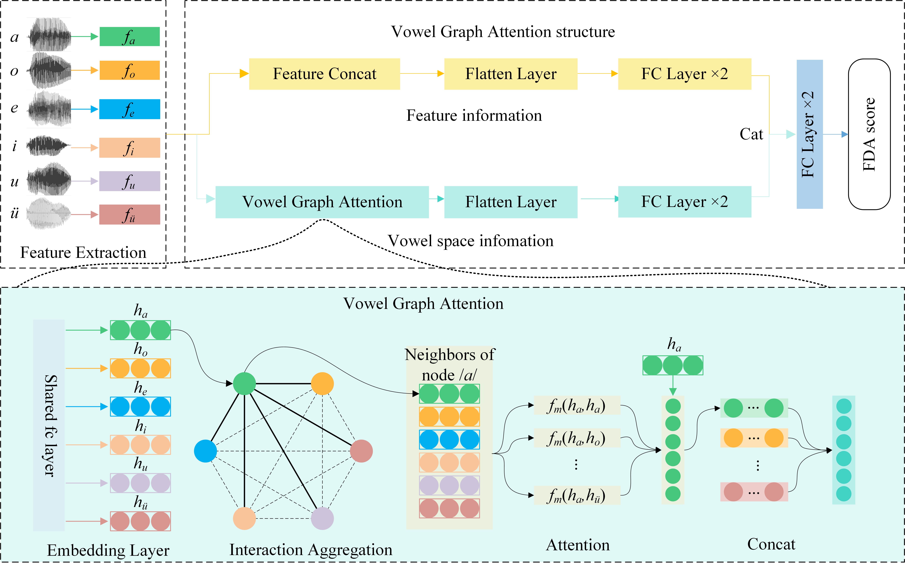

# VGAN
This repository contains the source code for our paper: Automatic Assessment of Dysarthria Using Audio-visual Vowel Graph Attention Network

## 1. Abstract
Automatic assessment of dysarthria remains a highly challenging task due to the high heterogeneity in acoustic signals and the limited data. Currently, research on the automatic assessment of dysarthria primarily focuses on two approaches: one that utilizes expert features combined with machine learning, and the other that employs data-driven deep learning methods to extract representations. Studies have shown that expert features can effectively account for the heterogeneity of dysarthria but may lack comprehensiveness. In contrast, deep learning methods excel at uncovering latent features. Therefore, integrating the advantages of expert knowledge and deep learning to construct a neural network architecture based on expert knowledge may be beneficial for interpretability and assessment performance. In this context, the present paper proposes a vowel graph attention network based on audio-visual information, which effectively integrates the strengths of expert knowledge and deep learning. Firstly, the VGAN (Vowel Graph Attention Network) structure based on vowel space theory was designed, which has two branches to mine the information in features and the spatial correlation between vowels respectively. Secondly, a feature set based on expert knowledge and deep representation is designed. Finally, visual information was incorporated into the model to further enhance its robustness and generalizability. The method exhibited superior performance in regression experiments targeting Frenchay scores compared to existing approaches.

## Overview Architecture for VGAN

## Usage
### Requirements
+ python 3.8
+ Pytorch (1.8.2+cu111) and torchvision or above
+ CUDA 11.1 or above
+ scikit-learn 1.0.2
+ numpy 1.19.5

### Run the code
1. training command as follow
> python gnn_regression.py --config conf/train_gat1nn2papilipcmrlv.yaml --gpu 0 --label Frenchay

2. Testing command as follow.
> python gnn_regression.py --config conf/train_gat1nn2papilipcmrlv.yaml --gpu 0 --label Frenchay --test_flag

(The code was tested in Ubuntu 20.04 with Python 3.8.)

## Acknowledgement
Contributors:
Xiaokang Liu, Shangjun Lu, Di Cao